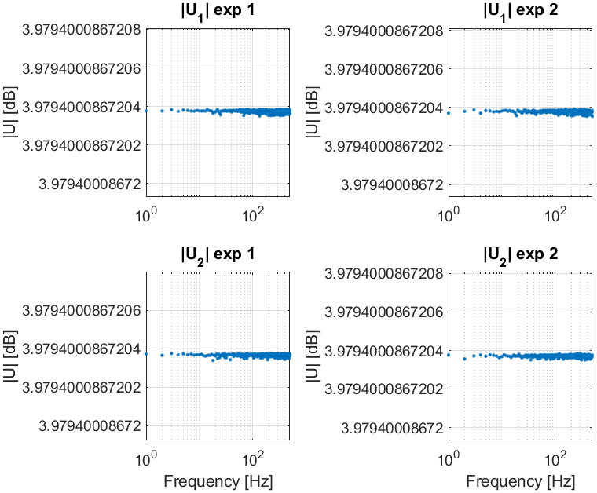
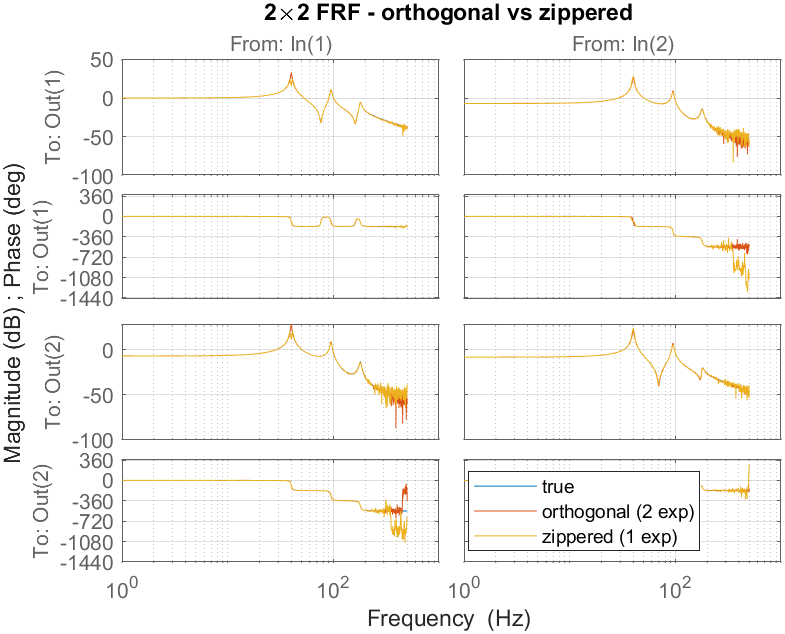
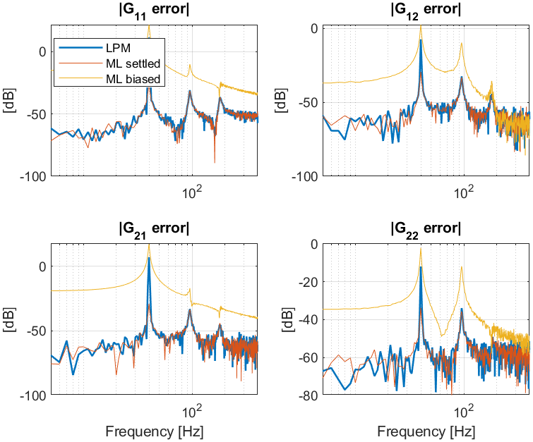
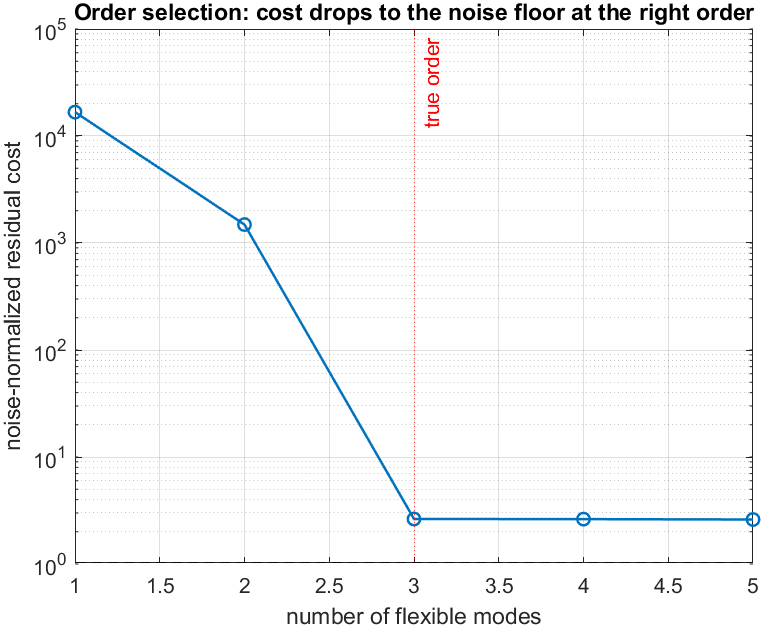
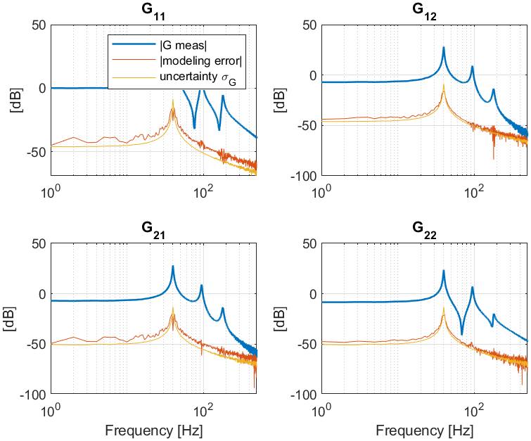

# FdiTools 3.0 — MIMO Step examples

Result gallery for the multi-input workflow (`Examples/Step_MIMO1` … `Step_MIMO6`),
on the shared 2×2 rank-one modal benchmark `mimobench` (modes ≈ 40 / 95 / 180 Hz).
See also [SISO Steps](Examples_Steps_SISO.md),
[SISO Tutorials](Examples_Tutorials_SISO.md), [MIMO Tutorial](Examples_Tutorials_MIMO.md).

---

## Step MIMO 1 — Excitation design (orthogonal & zippered)
Orthogonal (Hadamard) multisine over `n_in` experiments, plus the single-record
zippered design where each input owns interleaved excited lines.




*The spectra are flat across the excited lines (the y-axis auto-zooms to
floating-point level because every line has identical amplitude).*

---

## Step MIMO 2 — Full 2×2 FRF (orthogonal & zippered) + confidence band
Orthogonal multi-experiment and single zippered estimates both recover the full
2×2 FRF (`time2frf_ml`); the per-entry 95% confidence band comes from `sG`.




---

## Step MIMO 3 — MIMO LPM (positioning)
Orthogonal, full-resolution MIMO LPM from short, transient-corrupted records.
The main resonances (incl. the 40 Hz peak in G₁₁) are captured, and the LPM
error matches settled-ML while ML-with-transient is far worse.




---

## Step MIMO 4 — Nonlinear distortions (robust BLA)
M independent random-phase realizations → Best Linear Approximation. The scatter
across realizations (total) minus the scatter across periods (noise) gives the
stochastic nonlinear distortion level, which here dominates the noise by
20–30 dB.


*Per entry: |BLA|, total std, nonlinear std and noise std — nonlinear ≫ noise.*

---

## Step MIMO 5 — Structured modal identification
`frf2modal` (rank-one residues, two-stage additive→modal, van der Hulst et al.
MSSP 2026) fits a modal model to the 2×2 FRF; it overlays the true plant and the
nonparametric FRF.


---

## Step MIMO 6 — Model selection & validation
Sweep the number of flexible modes (the noise-normalized cost drops to its floor
at the true count of 3), then validate: the modeling error sits at the FRF
uncertainty σ_G across frequency.





```
--- identified modal parameters (selected order = 3) ---
 mode |  wn_true   wn_est [Hz] |  z_true    z_est
   1  |    40.00     40.00     |  0.010    0.010
   2  |    95.00     95.00     |  0.015    0.015
   3  |   180.00    179.98     |  0.020    0.020
modal-model FRF fit vs true : 98.52 %
noise-normalized cost       : 2.63
```
