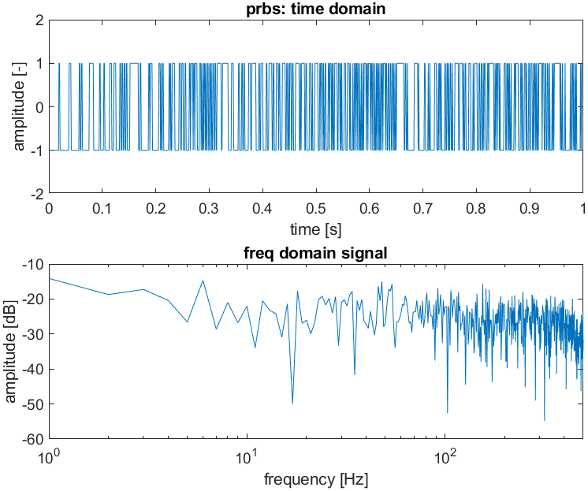
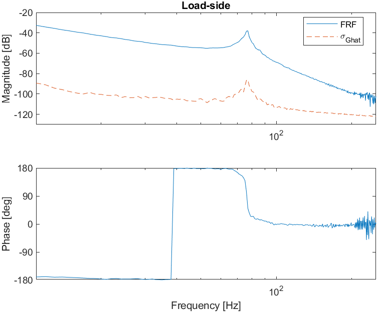
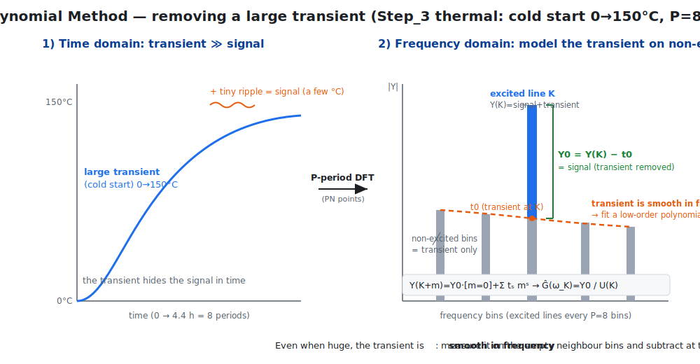
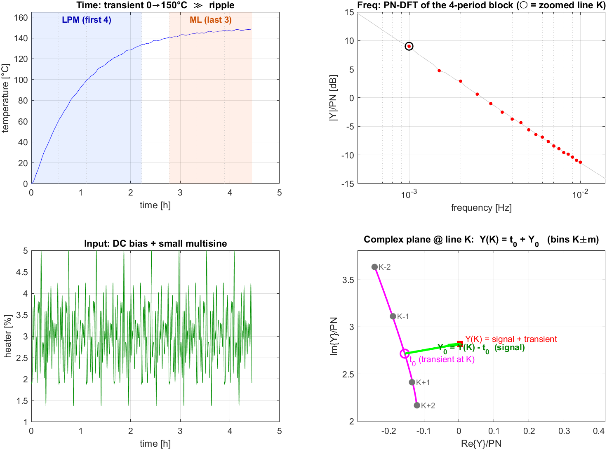
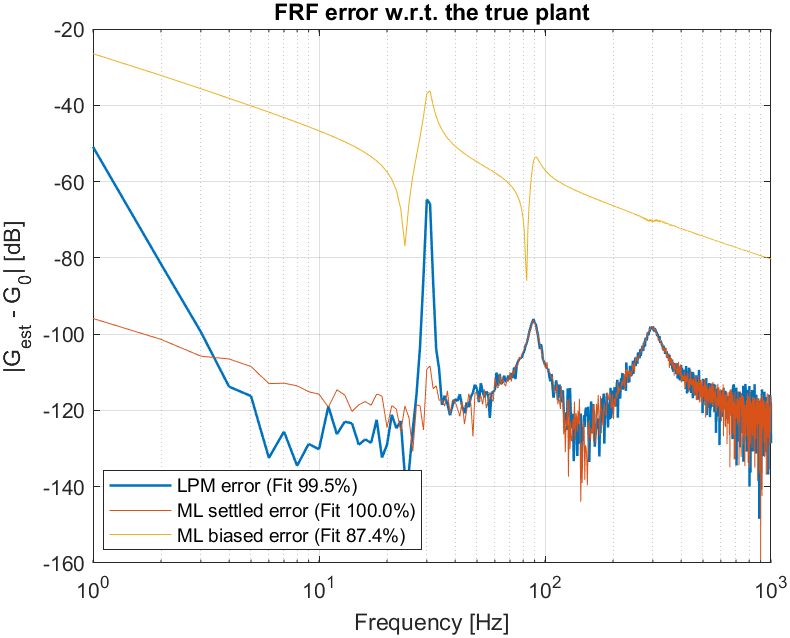
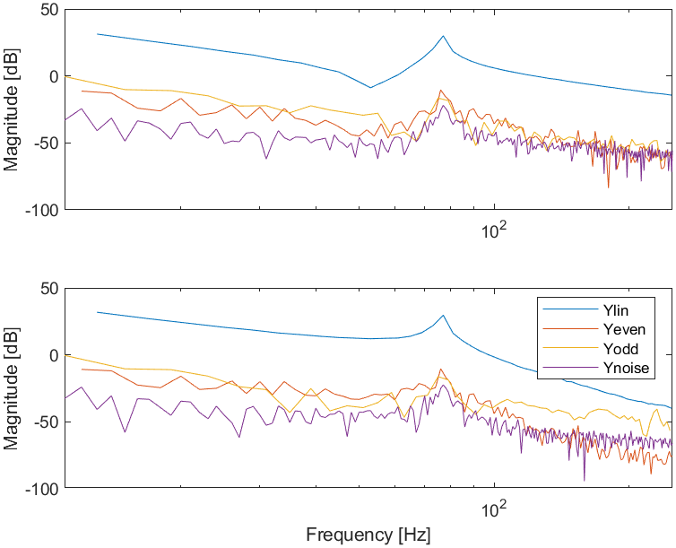
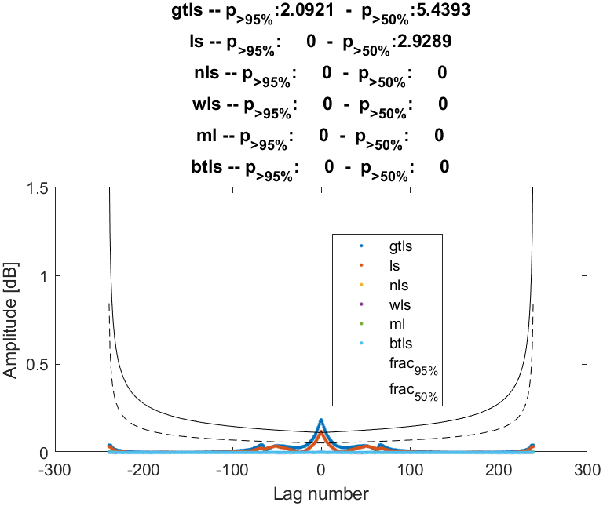
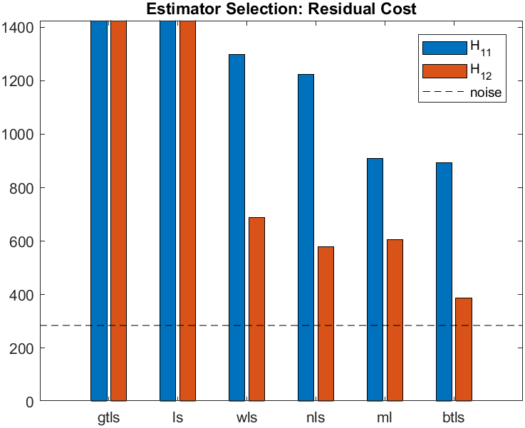

# FdiTools 3.0 — SISO/SIMO Step examples

Result gallery for the single-input workflow (`Examples/Step_1` … `Step_6`).
Run an example, then `savefigs('<name>')` (or `export_all_figs`) to regenerate the
images in `Examples/plot/`. See also [MIMO Steps](Examples_Steps_MIMO.md),
[SISO Tutorials](Examples_Tutorials_SISO.md), [MIMO Tutorial](Examples_Tutorials_MIMO.md).

---

## Step 1 — Excitation design (multisine)
Random/Schroeder multisine design: time signal, excited-line spectrum and crest
factor. Low crest factor (≈1.4) packs energy efficiently into the excited lines.





---

## Step 2 — Non-parametric FRF + uncertainty
Periodic maximum-likelihood FRF (`time2frf_ml`) on the motor bench. The FRF
standard deviation `UserData.sG` and the 95% circular confidence band
(`frfconf`) quantify the uncertainty; with fewer averaged periods the band
widens.



*Load-side FRF with the FRF standard deviation σ_G (≈40–60 dB below the signal).*


*With only 3 periods the 95% band visibly widens at the anti-resonance.*

---

## Step 3 — Local Polynomial Method (LPM): thermal furnace
Heater→temperature (low-pass, time-constant of hours). Starting cold gives a
long thermal transient; the LPM models it from the non-excited lines, so a
**short** record gives a low-bias FRF without waiting for settling — while the
classical ML is biased if the transient is kept.

**How LPM removes the large transient** — in the time domain the cold-start
transient (0→150 °C) dwarfs the small excitation ripple. But in the P-period DFT
the transient is a *smooth* spectral contribution, present at every bin; the
non-excited bins between the excited lines therefore show the transient alone. A
low-order polynomial fits it there and is subtracted at each excited line
(`Y0 = Y(K) − t0`, `Ĝ = Y0/U(K)`):



**Worked example on the simulation** (run `Examples/lpm_explained.m`). Notation:

- **N** = samples per period (`N = fs/df`; here 200),
- **P** = number of periods in the LPM record (the first `nL = 4` periods used
  here, so `P = 4`),
- the analysis is **one PN-point DFT** over that whole block (`PN = P·N = 800`
  points) — *not* a period-by-period transform. On the PN grid the excited
  lines sit on every **P-th** bin; the `P−1` bins between them carry the
  transient only.

The complex-plane panel (bottom-right) shows, at one excited line *K*: the
non-excited neighbours (bins `K±m`) trace the smooth transient, the polynomial
gives the transient `t0` at *K*, and `Y0 = Y(K) − t0` is the recovered signal
(`Ĝ = Y0/U(K)`).




```
FRF fit vs true plant
LPM (first 4 periods, transient)   :  99.3 %
ML  (settled, last 3 periods)      :  46.7 %
ML  (first periods, transient kept): -589.5 %
```

## Step 3 — Local Polynomial Method (LPM): positioning stage
Force→velocity benchmark. From rest the lightly-damped resonances ring; the LPM
recovers the FRF from the early (transient) periods at a quality comparable to
ML on the settled periods, and far better than ML with the transient kept.




```
FRF fit vs true plant
LPM (first 3 periods, transient)   :  99.5 %
ML  (settled, last 2 periods)      : 100.0 %
ML  (first periods, transient kept):  87.4 %
```

---

## Step 4 — Nonlinear distortion detection
Odd-odd random-phase multisine: the output spectrum is split into the linear
contribution and the even/odd nonlinear distortions and the noise floor. Here
the distortions sit well below the linear response.



---

## Step 5 — Parametric estimation
Deterministic (WLS/NLS/LS) and stochastic (MLE/BTLS/GTLS) single-denominator
estimators fitted to the FRF; the uncertainty `sG` bounds the achievable fit.


---

## Step 6 — Model selection & validation
Three independent tests answer two questions: **which estimator is best** and
**is the model adequate?** The plant is the 2-inertia motor bench (one resonance;
two outputs θ_m, θ_l), fitted by six estimators (gtls / ls / wls / nls / ml / btls).

| test | what it checks | yardstick |
|---|---|---|
| 1 — residual whiteness | the **shape** (correlation) of the residual | white-noise confidence bounds |
| 2 — residual cost | the **level** of the residual (down to the noise?) | the noise floor (E[V] ≈ F − nθ) |
| 3 — χ² modeling error | model error vs the **measurement uncertainty** | the FRF CR bound σ_Ĝ (= sCR) |

### Test 1 — residual whiteness (one figure per output)
Residual autocorrelation vs lag; **solid black = 95 %** bound, **dashed = 50 %**
bound; the title reports the fraction of lags exceeding each bound. A *white*
residual exceeds the 95 %/50 % bounds only ≈5 %/50 % of the time, so a **small
exceedance = good** (no left-over, unmodelled dynamics). The bounds widen at
large lags because fewer samples remain.




### Test 2 — residual cost (estimator comparison)
One bar per estimator (blue = H₁₁ iq→θ_m, red = H₁₂ iq→θ_l); the **dashed line is
the noise level**. A bar near the noise floor ⇒ the residual is essentially noise
(good); well above ⇒ remaining **model error / bias**. Order: **gtls / ls are
worst** (ls ignores the noise weighting; gtls mis-weights the
errors-in-variables structure), improving wls → nls → ml → **btls, which reaches
the noise floor** — exactly as theory predicts (estimators that correctly treat
input *and* output noise are efficient).



> Test 1 can pass while Test 2 sits slightly above the floor — not a
> contradiction: Test 1 is the residual's **shape**, Test 2 is its **level**
> ("no concentrated leftover, but a small broadband error remains").

### Test 3 — χ² modeling error vs the CR bound (one figure per output)
Per frequency, the modeling error `|G_model − Ĝ_meas|` (coloured) is compared
with the measurement uncertainty σ_Ĝ (= sCR, **black**). **Below** the black line
⇒ the error is buried in the measurement noise → **adequate** (cannot do better
with this data); **above** it ⇒ a systematic model error there. Here the errors
stay below the CR bound across the band, rising toward it near the resonance (the
hardest region to fit).


### What the "CR bound" is (and is not)
The Cramér–Rao bound is the **lower bound on the variance of an *estimate***
(`Cov(θ̂) ⪰ Fi⁻¹`), fixed by the experiment + noise + model structure. It does
**not** depend on which estimator you use, and it is **not** the residual. In
Test 3 the `crlb` line is the **non-parametric FRF uncertainty** σ_Ĝ (= sCR) —
the measurement floor against which the model error is judged. (The dashed
"noise floor" in Test 2 is a *different* floor: the expected residual cost. Both
are "floors", but distinct quantities.)

### Bottom line
- **Best estimators: btls / ml** (residual cost closest to the noise floor;
  residuals white). **Avoid ls / gtls** (large bias).
- **Model is adequate**: residuals white (Test 1) and model error ≤ CR bound
  almost everywhere (Test 3).
- **Room to improve**: residual cost slightly above the floor (esp. H₁₁) and the
  error rises near the resonance → raise the model order *n*, concentrate
  excitation around the resonance, or revisit the transient removal.
- **Roles**: Test 1 = shape (whiteness), Test 2 = level (down to the noise?),
  Test 3 = per-frequency, below the measurement uncertainty? All three together
  justify "the model is adequate".
