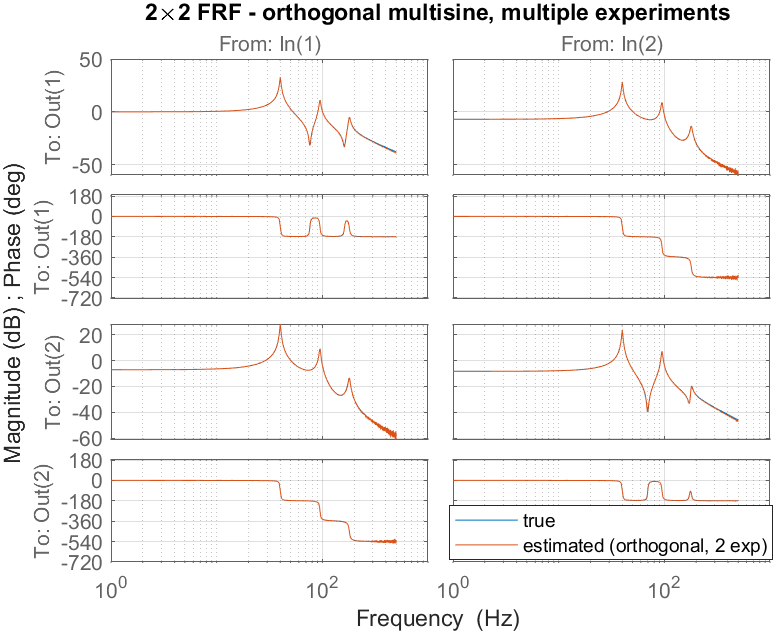
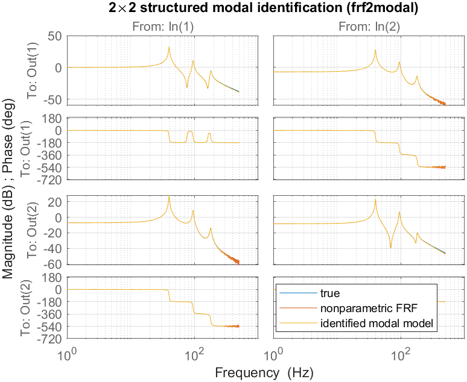

# FdiTools 3.0 — MIMO Tutorial

Result gallery for `Examples/Tutorial_4_MIMO`. This tutorial walks the **full
multivariable workflow on a single 2×2 plant**: design the excitation, measure
the FRF two different ways, and fit a structured modal model — using the same
benchmark (`mimobench`) and the same routines as the
[MIMO Step series](Examples_Steps_MIMO.md), so the two can be read side by side.
See also [SISO Steps](Examples_Steps_SISO.md),
[SISO Tutorials](Examples_Tutorials_SISO.md).

## Benchmark and settings
`mimobench` is a 2-input/2-output, reciprocal, proportionally-damped modal plant
with three flexible modes — each a rank-one residue `g·φφᵀ` over a 2nd-order
denominator (so it matches the structure that `frf2modal` targets). The (1,1)
DC gain is normalised to 0 dB.

| mode | frequency `wn` [Hz] | damping `ζ` |
|---|---|---|
| 1 | 40 | 0.010 |
| 2 | 95 | 0.015 |
| 3 | 180 | 0.020 |

Output mode shapes `φ = [1 1 1; 0.6 −0.8 0.4]` give genuine (rank-one)
cross-coupling, so the off-diagonal terms `G₁₂`, `G₂₁` are physically meaningful
— not numerical dust.

| setting | value |
|---|---|
| sampling `fs` | 2500 Hz |
| resolution `df` | 1 Hz |
| excited band | 1 – 500 Hz |
| periods / transient | `nrofp = 5` / `trans = 1` |
| output noise | `1e-3` (sets the FRF floor) |

---

## Method A — orthogonal multisine, multiple experiments
`multisine(nrofi = 2)` builds two orthogonal (Hadamard) experiments: in each,
both inputs are driven with phase patterns that make the input matrix `U(2×2)`
invertible at every excited line, so `G = Y/U` yields the **full 2×2 FRF at every
line** (full per-channel resolution). This is the MIMO FRF of
[Step_MIMO2](Examples_Steps_MIMO.md).


*The estimate (orange) overlays the true plant (blue) across the band; only the
deep anti-resonances and the high-frequency roll-off (low SNR) show scatter.*

---

## Method B — zippered multisine, single experiment
One record only: input 1 excites the odd excited lines, input 2 the even ones.
At any excited line a single input is active, so each FRF **column** is read off
directly; `time2frf_ml` interpolates each column onto the full grid. One
experiment instead of two, at the cost of **half** the per-channel resolution.


*All four entries — including the off-diagonal cross-terms — track the true
plant, because `mimobench` has significant (rank-one) coupling. A resonance
sharper than the per-channel line spacing would be the limiting factor (see
[Step_MIMO3](Examples_Steps_MIMO.md) for the orthogonal, full-resolution LPM
alternative used when modes are very sharp).*

---

## Structured modal identification (`frf2modal`)
`mimobench` is a proportionally-damped, rank-one modal system, so `frf2modal`
recovers the modal parameters **directly from the orthogonal FRF estimate** `Pa`
— exactly the Step_MIMO5 flow. The two-stage method first fits an additive model
(poles by nonlinear LS, residues by variable projection), then projects each
residue to rank one (SVD) and refines against the FRF
(van der Hulst et al., *MSSP* 247 (2026) 113948).


*True plant, nonparametric FRF and the identified modal model overlap across the
whole band.*

Console output (modal parameters and FRF fit — the frequencies and damping are
recovered essentially exactly):

```
--- identified modal parameters ---
 mode |  wn_true   wn_est [Hz] |  z_true    z_est
   1  |    40.00     40.00     |  0.010    0.010
   2  |    95.00     95.00     |  0.015    0.015
   3  |   180.00    179.99     |  0.020    0.020
modal model FRF fit vs true : 99.08 %
```

A second call with `'damping','general'` fits **complex** mode shapes
(general-viscous damping, eqs. (2),(6),(46)). It also fits proportionally-damped
data — the complex mode shapes then come out essentially real — so it is the
safe default when the damping structure is unknown:

```
general-damping wn_est [Hz] : 40.00 94.99 180.00
general modal FRF fit vs true: 99.06 %
```

---

### Reproduce
```matlab
cd Examples
addpath(genpath('../src'))
Tutorial_4_MIMO          % runs methods A & B + modal identification
savefigs('Tutorial_4_MIMO')
```

### Key takeaways
- **Orthogonal vs zippered**: orthogonal needs `n_in` experiments but gives full
  resolution; zippered needs one record but halves the per-channel resolution.
- **One benchmark, whole pipeline**: the same `mimobench` and routines as the
  Step_MIMO series — design → FRF → modal model — so results are directly
  comparable.
- **`frf2modal`** recovers physical modal parameters (frequency, damping, rank-one
  mode shapes) from the measured FRF, with proportional or general-viscous
  damping.
