# FdiTools 3.0 — SISO Tutorials

Result gallery for the single-input tutorials. See also
[SISO Steps](Examples_Steps_SISO.md), [MIMO Steps](Examples_Steps_MIMO.md),
[MIMO Tutorial](Examples_Tutorials_MIMO.md).

---

## Tutorial 1 — chirp (swept-sine) excitation
Swept-sine time/frequency signal, coherence, and the estimated FRF vs the true
plant.

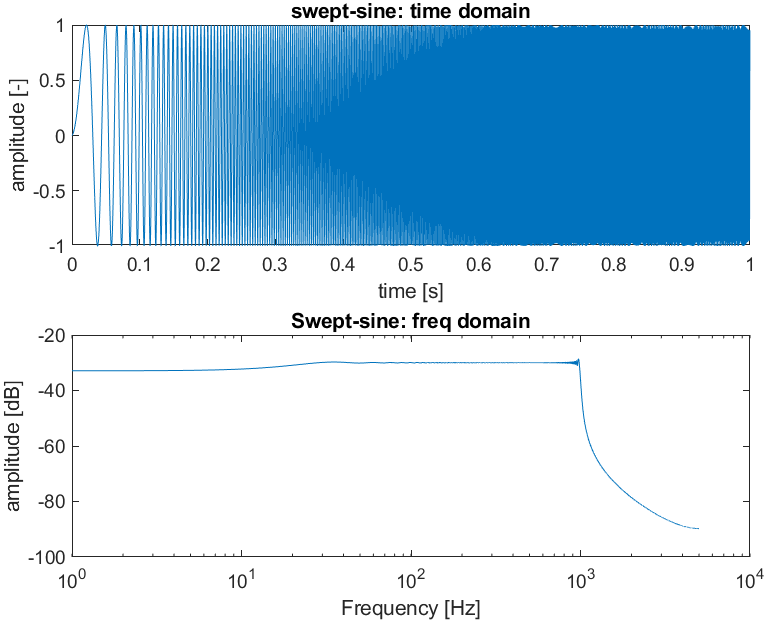

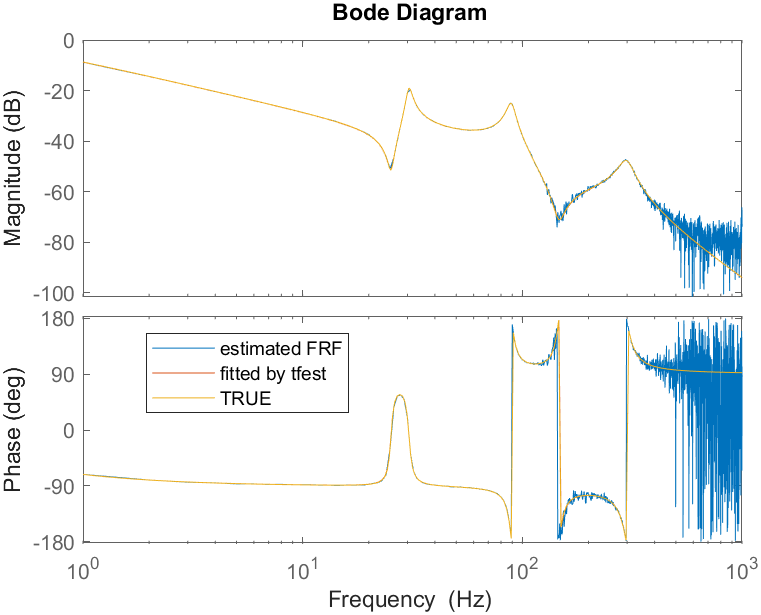

## Tutorial 1 — random excitation
Non-periodic random excitation: coherence (good in-band, drops at the
anti-resonance and out of band) and the estimated FRF.

## Tutorial 1 — quasi-logarithmic multisine
Quasi-log grid multisine, the time-domain input/output, FRF with noise model,
the 95% confidence band, and the parametric estimators.

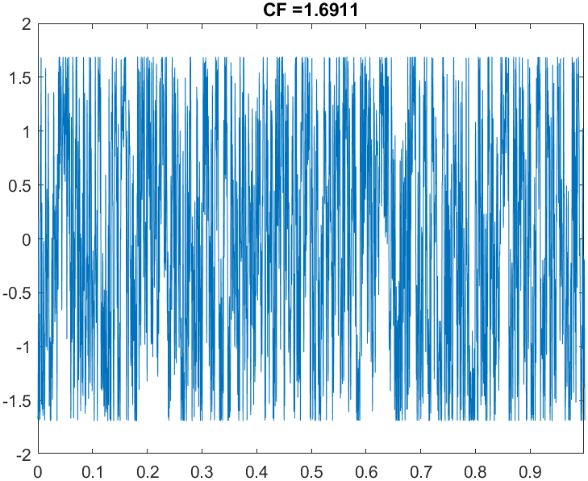

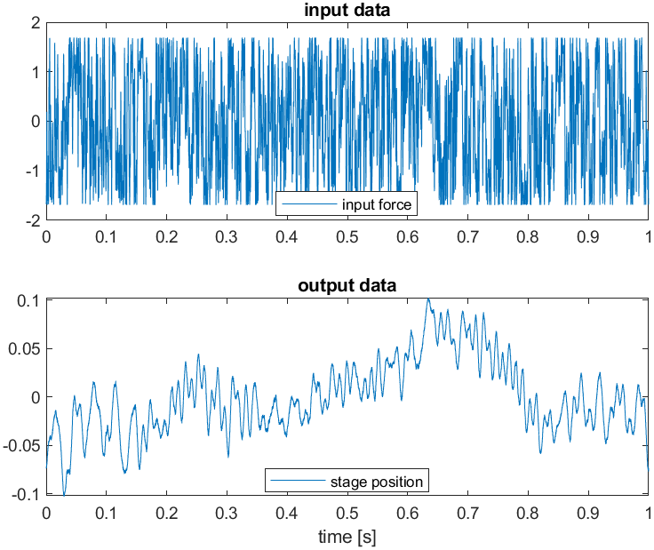
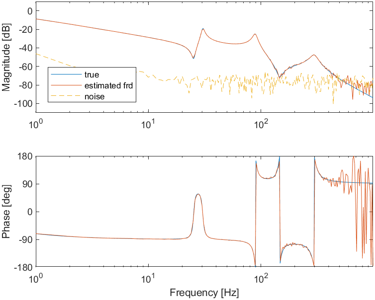
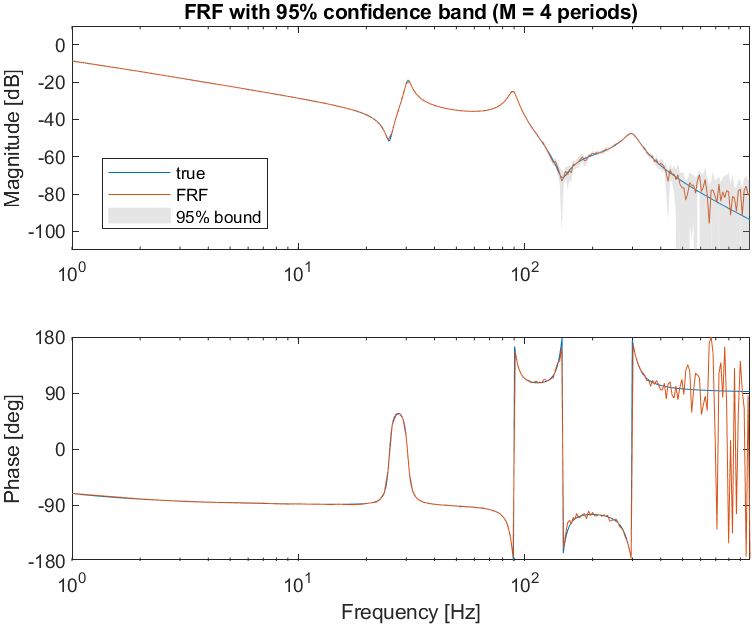
*The 95% band widens at high frequency where the SNR drops.*

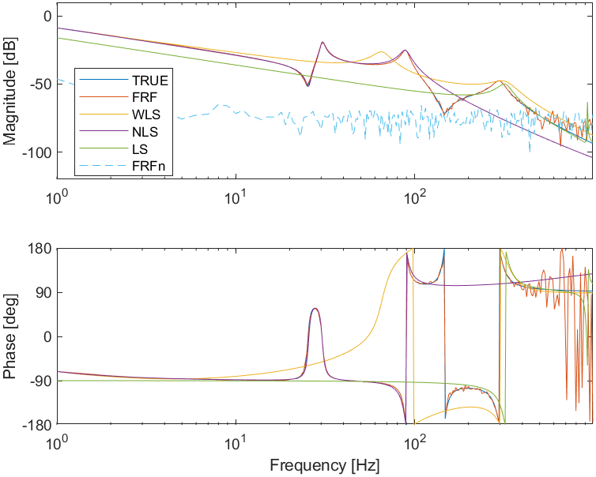

---

## Tutorial 2 — iterative experiment design (inverse S/N)
Three experiments — wideband, then refined via the inverse signal-to-noise
ratio, then concentrated at high frequency — are merged (`fcat_fdi`) into one
low-uncertainty FRF. The crest-factor optimiser converges to CF ≈ 1.69 / 1.95 /
2.22 for the three designs.

Excitation designs and per-band FRFs for the three experiments:

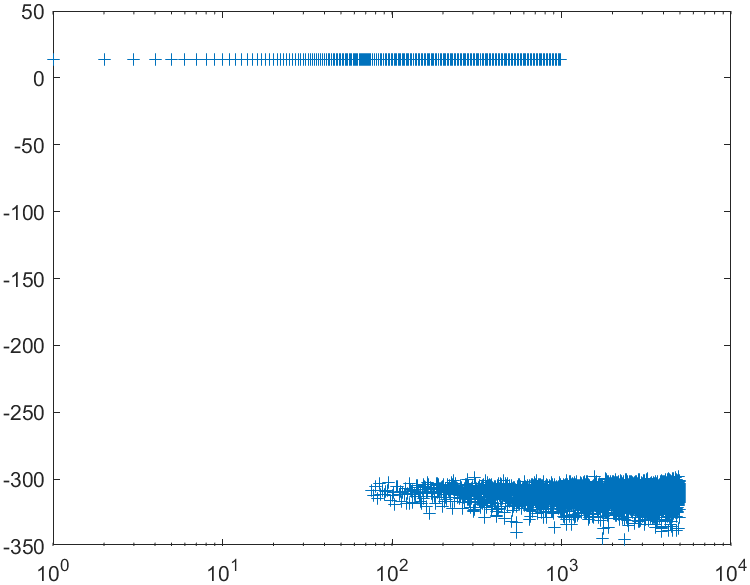
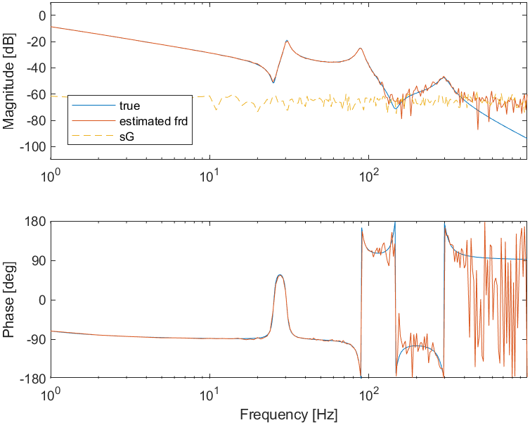

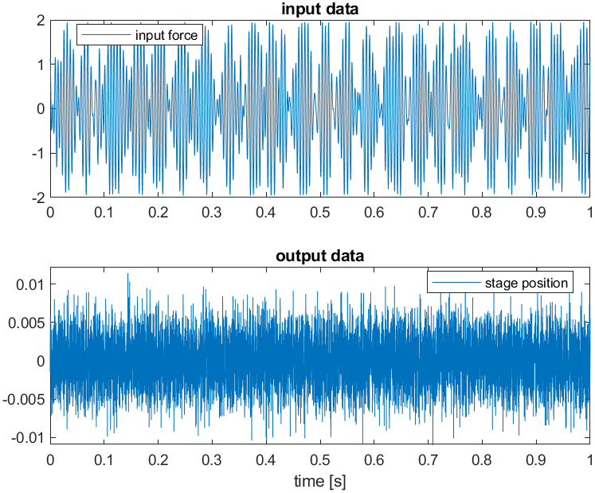

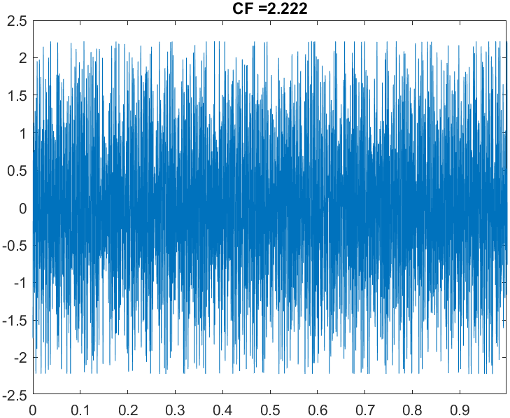

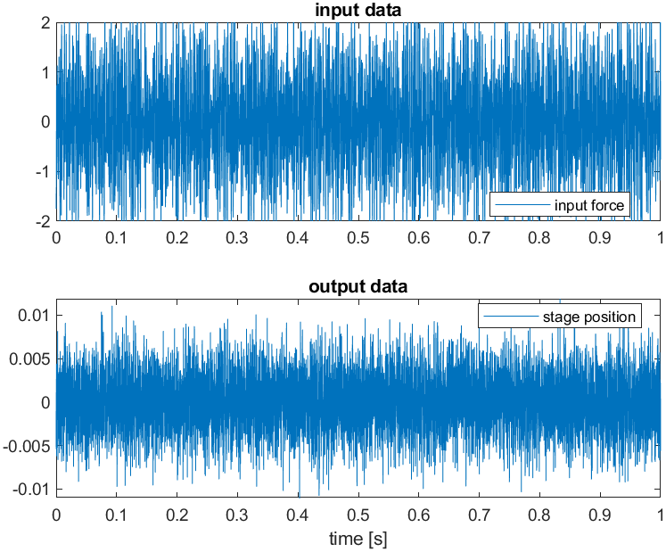

Single vs iterative experiment, and the resulting estimation error:

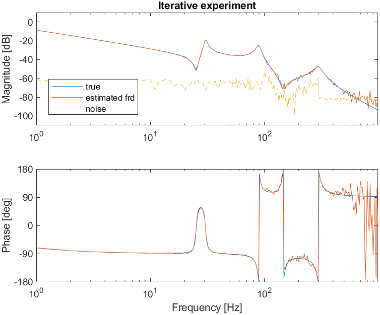

*Key result: the iterative design lowers the estimation error in the targeted
high-frequency range.*

Parametric estimation on the merged FRF:

*(GTLS is a rough starting-value estimator and can degenerate; MLE/BTLS are the
reliable ones.)*

---

## Tutorial 3 — nonlinear distortions, input nonlinearity
Distortion analysis at increasing input amplitudes (and a linear reference).

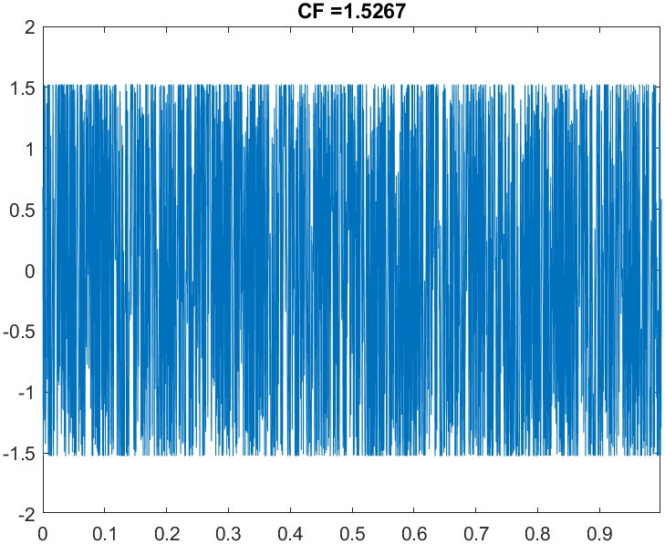

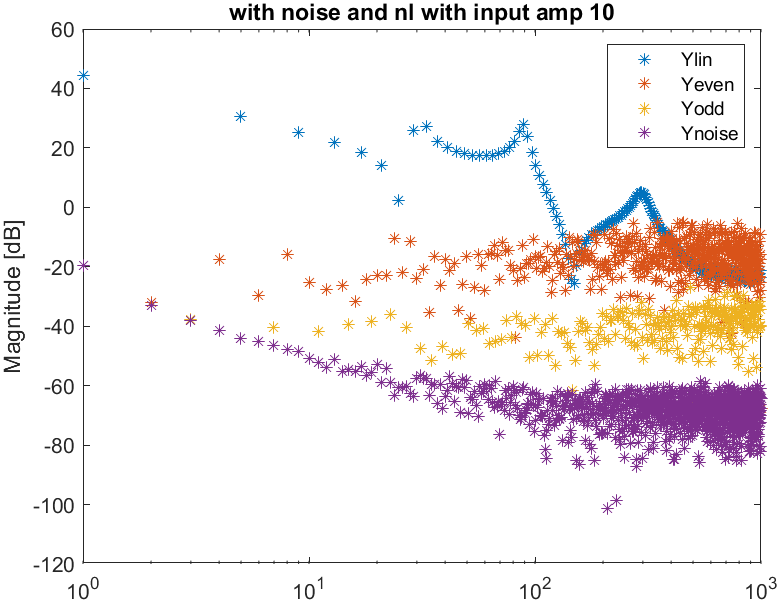

## Tutorial 3 — nonlinear distortions, output nonlinearity
Same sweep for an output (Wiener-type) nonlinearity.

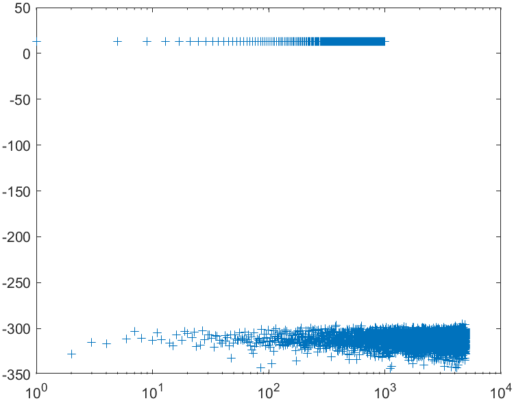
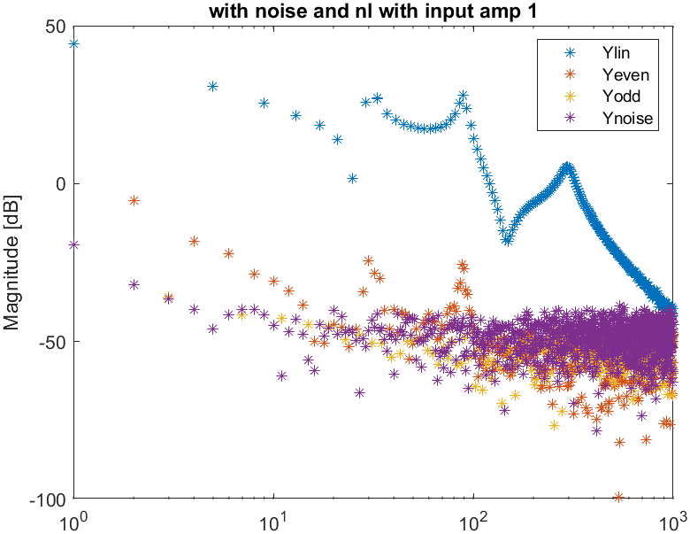
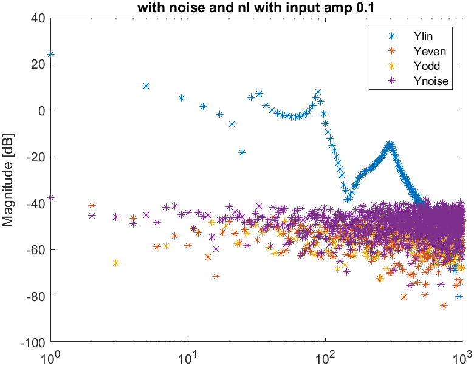

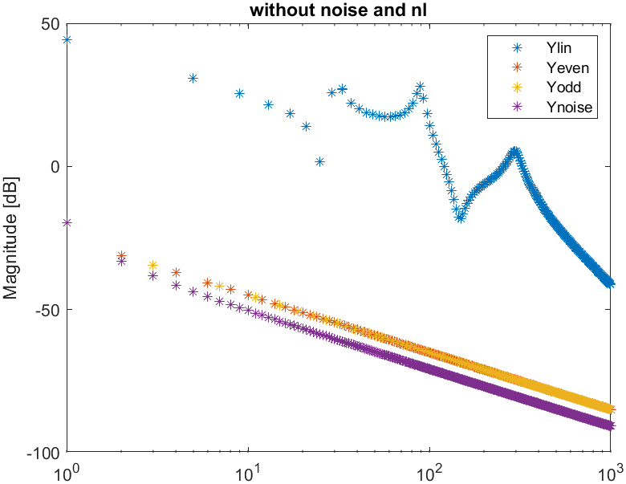
