# FdiTools (Python)

Python port of **FdiTools**, the Frequency-Domain System Identification toolbox —
a Python version of [HoriFujimotoLab/FdiTools](https://github.com/HoriFujimotoLab/FdiTools).
It mirrors the original MATLAB API and algorithms on top of [`numpy`](https://numpy.org/),
[`scipy`](https://scipy.org/) and [`python-control`](https://python-control.readthedocs.io/).

> Main reference: R. Pintelon and J. Schoukens, *System Identification: A
> Frequency Domain Approach*, 2nd ed. Wiley-IEEE Press, 2012.

## Installation

You need **Python 3.9+**.  The toolbox depends on `numpy`, `scipy` and
`python-control` (and `matplotlib` for plotting).  The recommended setup uses a
*virtual environment* (`venv`) — a self-contained Python just for this project,
so it never interferes with other Python installs.  Total time: a couple of
minutes.

> **Windows note:** if typing `python` opens the Microsoft Store, Python is not
> actually installed. Install it from
> [python.org](https://www.python.org/downloads/) (tick *“Add python.exe to
> PATH”*) or run `winget install Python.Python.3.12`, then use the `py` launcher
> shown below.

### 1. Get the code

```bash
git clone https://github.com/WataruOhnishi/FdiTools_Python.git
cd FdiTools_Python
```

### 2. Create and activate a virtual environment

Windows (PowerShell):

```powershell
py -m venv .venv
.\.venv\Scripts\Activate.ps1        # the prompt then shows (.venv)
```

macOS / Linux:

```bash
python3 -m venv .venv
source .venv/bin/activate
```

> If PowerShell refuses to run `Activate.ps1`, either run once
> `Set-ExecutionPolicy -Scope CurrentUser RemoteSigned`, or skip activation and
> just call `.\.venv\Scripts\python.exe ...` directly in the commands below.

### 3. Install the toolbox

```bash
pip install -e .          # fditools + numpy / scipy / control
pip install -e ".[test]"  # also pytest + matplotlib (needed for examples & tests)
```

`-e` (*editable*) means changes you make to the source take effect immediately —
handy while developing.  This step also makes `import fditools` work from **any**
directory (it is the Python equivalent of MATLAB's `addpath`; see
[*How importing works*](#how-importing-works-the-path-question)).

### 4. Check that it works

```bash
python -c "import fditools; print(fditools.__version__)"   # -> 0.1.0
pytest                                                     # 36 tests should pass
python examples/step2_nonparametric_frf.py                 # runs an example
```

### Using it in VS Code

Open the `FdiTools_Python` folder, install the **Python** extension (Microsoft),
then `Ctrl+Shift+P → Python: Select Interpreter` and choose the `.venv` one.
New terminals then activate `.venv` automatically, and the ▷ *Run* button uses it.

### How importing works (the "path" question)

Unlike MATLAB's `addpath`, you don't add a folder to a search path.  Instead
`pip install` registers the **`fditools` package** with your environment, so
`import fditools` works anywhere within that venv — no per-script setup.

If you prefer **not** to install, you can instead add the repository root (the
folder that *contains* `fditools/`, not `fditools/` itself) to `sys.path`:

```python
import sys
sys.path.insert(0, r"C:\path\to\FdiTools_Python")   # folder that holds fditools/
import fditools
```

Either way, remember a venv is per-project and per-machine: on a new clone or a
new computer, repeat steps 2–3 (the `.venv` folder itself is **not** committed to
git).

## Using it in a Jupyter notebook

The toolbox works the same in notebooks. Install Jupyter **into the project's
`.venv`** (so it can see `fditools`):

```bash
pip install jupyterlab ipykernel      # once, with the venv active
jupyter lab                           # opens in your browser
```

Or in **VS Code**: create a `.ipynb` file, click *Select Kernel* (top-right) and
choose the `.venv` interpreter — nothing else to install.

In a notebook, figures render **inline** automatically — no `plt.show()` and no
blocking window:

```python
import numpy as np, control, fditools as fdi

P0 = control.tf([(2*np.pi*120)**2], [1, 2*0.02*2*np.pi*120, (2*np.pi*120)**2])
harm = dict(fs=2000.0, df=1.0, fl=5.0, fh=400.0, fr=1.02)
ms = fdi.multisine(harm, control.tf([1], [1]),
                   dict(itp="r", ctp="c", dtp="f", gtp="q"))

u = np.tile(np.squeeze(ms.x[0, 0, :]), 6)
t = np.arange(u.size) / harm["fs"]
y = control.forced_response(P0, t, u).outputs

x, _ = fdi.pretreat(u, ms.nrofs, harm["fs"], 1, 0)
y, _ = fdi.pretreat(y, ms.nrofs, harm["fs"], 1, 0)
Pest = fdi.time2frf_ml(x, y, ms)
fig, _ = fdi.bode_fdi(Pest)            # displays inline
```

> To reuse the helpers in `examples/` from a notebook (e.g.
> `from _data import benchmark_plant`), add that folder to the path first:
> `import sys; sys.path.insert(0, "examples")`.

## Troubleshooting

| Symptom | Cause / fix |
|---|---|
| Typing `python` opens the Microsoft Store | The real Python isn't on `PATH`. Use `py`, or the venv's `.\.venv\Scripts\python.exe`; or turn off *Settings → Apps → Advanced app settings → App execution aliases → `python.exe`/`python3.exe`*. |
| `ModuleNotFoundError: No module named 'fditools'` | The active interpreter isn't the one where you ran `pip install -e .`. Activate the venv (or pick `.venv` in VS Code) and re-run `pip install -e .`. |
| PowerShell: *“Activate.ps1 cannot be loaded … running scripts is disabled”* | Run once `Set-ExecutionPolicy -Scope CurrentUser RemoteSigned`, or skip activation and call `.\.venv\Scripts\python.exe` directly. |
| A script "hangs" / the terminal won't accept the next command | `plt.show()` **blocks until you close the figure window**. Close the window (don't press Ctrl+C), or set `FDI_NOSHOW=1` to only save PNGs. |
| `ModuleNotFoundError: No module named '_data'` when running an example | Run it as `python examples/<name>.py` (the script's own folder is what makes `_data`/`_plot` importable). |
| `FileNotFoundError: ident_python.mat not found` | Normally can't happen — the converted model is committed to the repo. Only occurs if that file was deleted; regenerate it in MATLAB (`cd MATLAB/Examples/private; convert_ident_to_python`). Tutorials also fall back to a synthetic plant via `benchmark_plant()`. |
| No figure window appears at all | Make sure `matplotlib` is installed (`pip install matplotlib`) and you run a **`.py` file** (the ▷ *Run Python File* button), not "Run Selection in Interactive Window". In notebooks, figures are inline. |
| `pytest` warns *“could not create cache path … [WinError 123]”* | Harmless — run `pytest` from the repository root, or ignore it; the tests still pass. |

## Module map

| MATLAB folder | Python subpackage | Contents |
|---|---|---|
| `1_ExcitationDesign` | `fditools.excitation` | `multisine`, `sweptsine`, `prbs`, `multisine2hdr`, phase helpers |
| `2_NonparametricFRF` | `fditools.nonparametric` | `pretreat`, `time2frf_ml`, **`time2frf_lpm`**, `time2frf_h1`, `time2frf_log`, `splinefit` |
| `3_NonlinearDistortions` | `fditools.nonlinear` | `time2bla`, **`time2bla_mimo`**, `time2nld` |
| `4_ParametricEstimation` | `fditools.parametric` | `lsfdi`, `wlsfdi`, `nlsfdi`, `mlfdi`, `gtlsfdi`, `btlsfdi`, `ssfdi`, **`frf2modal`** |
| `5_SelectionValidation` | `fditools.validation` | `chi2test`, `costtest`, `residtest` |
| `A_CalculationAuxiliary` | `fditools.auxiliary` | `ba2theta`, `theta2ba`, `ba2hm`, `hm2ba`, `hfrf`, `cr_rao`, **`frfconf`**, `f2t`, `t2f`, `dbm`, `phs`, `fdel_fdi`, `fcat_fdi`, `fdicohere`, `bode_fdi` |

All names are also re-exported at the top level, e.g. `import fditools as fdi; fdi.multisine(...)`.

### What's new in v3.0

* **`time2frf_lpm`** — Local Polynomial Method: estimates the FRF *and* the
  transient, so short, transient-corrupted records give low-bias FRFs (periodic
  or broadband; SISO/SIMO and orthogonal-multisine MIMO).
* **`frf2modal`** — structured (rank-one residue) MIMO modal identification,
  proportional or general (viscous) damping; returns modal parameters and a real
  `control.StateSpace`.
* **MIMO** throughout `time2frf_ml` / `time2frf_lpm` / `time2bla_mimo` via
  orthogonal multiple-experiment (or single zippered) multisines — pass the
  experiments as a `(N, nch, ne)` array.
* **`frfconf`** — confidence-radius factor (PS2012 eq.2-40); **`bode_fdi`** gains
  uncertainty `line`/`band` overlays.
* The FRF standard deviation is now `UserData.sG` (`= sqrt(2)*sCR`, was `sGhat`);
  `UserData.nrofp` (averaged periods) and `UserData.method` are also stored.

## Repository layout

```
fditools/        Python package (the toolbox)
tests/           pytest test-suite
examples/        Python example scripts (Step 1–5 + tutorials)
docs/img/        figures shown in this README
pyproject.toml   Python packaging / dependencies
MATLAB/          the original MATLAB toolbox (kept for reference)
  src/             MATLAB source functions
  Contents.m       MATLAB toolbox contents
  Examples/        MATLAB example scripts + measurement data (private/*.mat)
  README.md        original MATLAB README
```

Python is the main implementation; everything MATLAB lives under `MATLAB/`.

## Quick start

```python
import numpy as np
import control
import fditools as fdi

# true plant (for the demo)
P0 = control.tf([(2*np.pi*120)**2], [1, 2*0.02*2*np.pi*120, (2*np.pi*120)**2])

# 1) design a quasi-log multisine
harm = dict(fs=2000.0, df=1.0, fl=5.0, fh=400.0, fr=1.02)
options = dict(itp="r", ctp="c", dtp="f", gtp="q")
ms = fdi.multisine(harm, control.tf([1], [1]), options)

# experiment: 6 periods through the plant
u = np.tile(np.squeeze(ms.x[0, 0, :]), 6)
T = np.arange(u.size) / harm["fs"]
y = control.forced_response(P0, T, u).outputs

# 2) non-parametric FRF (maximum likelihood)
xp, _ = fdi.pretreat(u, ms.nrofs, harm["fs"], 1, 0)
yp, _ = fdi.pretreat(y, ms.nrofs, harm["fs"], 1, 0)
Pest = fdi.time2frf_ml(xp, yp, ms)          # -> fditools.FrfData

# 3) parametric estimation
n, mh, ml = 2, 0, 0
Hml, Hls = fdi.mlfdi(Pest, n, mh, ml, 500, 1e-10, 0, "c")
Hbtls, Hgtls = fdi.btlsfdi(Pest, n, mh, ml, 1.0, 500, 1e-10, "c")
sys_ml = control.tf(Hml[0, 0])              # a control.TransferFunction
```

A runnable end-to-end demo (with optional plots) is in
[`examples/tutorial_1_qlog.py`](examples/tutorial_1_qlog.py).

## Examples

All example scripts live in [`examples/`](examples/), save their figures as PNGs
next to the script, and open interactive windows (set `FDI_NOSHOW=1` to only save
PNGs).  They are ports of the original MATLAB scripts under
[`MATLAB/Examples/`](MATLAB/Examples).

```bash
python examples/step2_nonparametric_frf.py      # run any example
```

### Step 1–5 workflow

Ported from MATLAB `Step_1`–`Step_5`, running on the original motor-bench
measurement data (`MATLAB/Examples/private/*.mat`, read directly with SciPy —
**no MATLAB required**).

**Step 1 — excitation design** &nbsp;(`step1_excitation_design.py` ← `Step_1_ExcitationDesign.m`): multisine / PRBS / swept-sine.

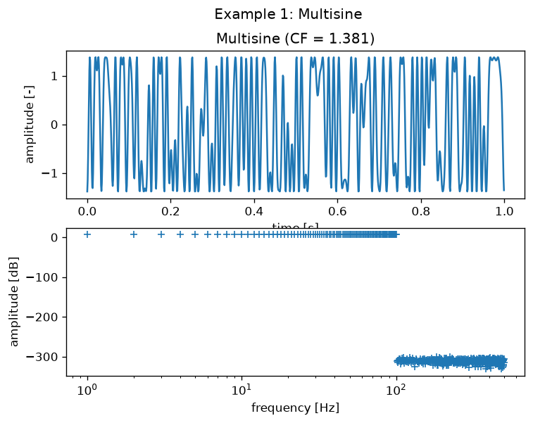

**Step 2 — non-parametric FRF** &nbsp;(`step2_nonparametric_frf.py` ← `Step_2_NonparametricFRF.m`): maximum-likelihood FRF, motor- and load-side (`MultisineTypeA.mat`).

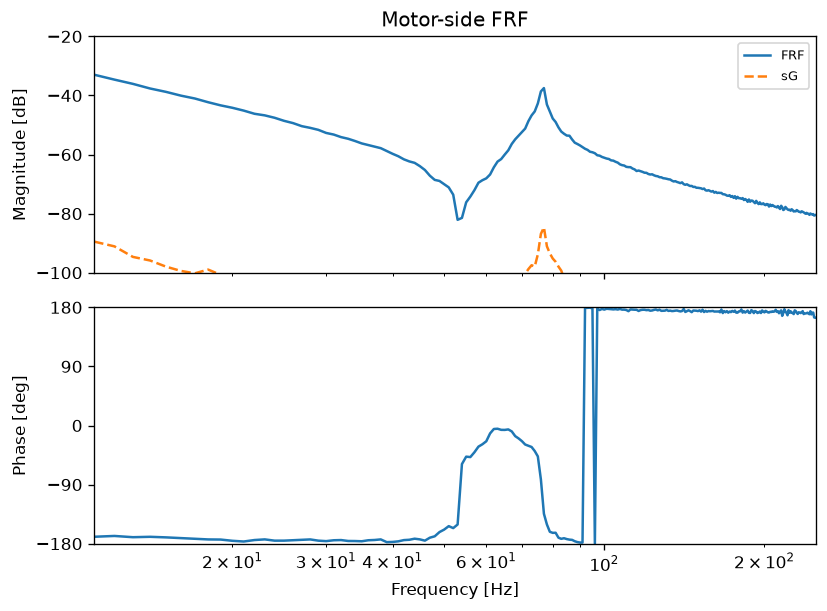
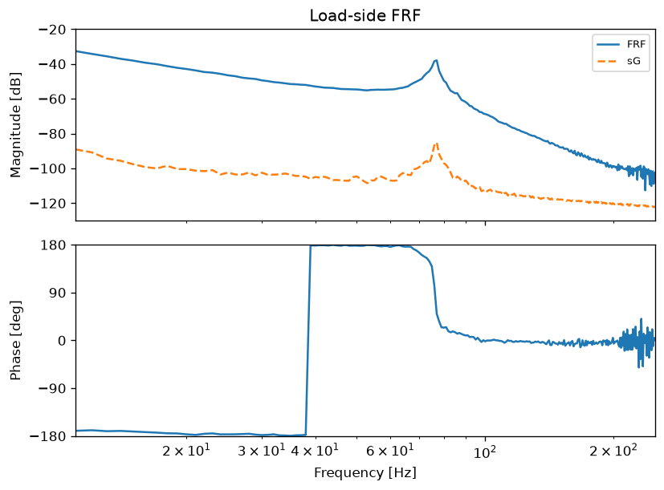

**Step 3 — non-linear distortions** &nbsp;(`step3_nonlinear_distortions.py` ← `Step_3_NonlinearDistortions.m`): linear / even / odd / noise split (`MultisineTypeB.mat`).

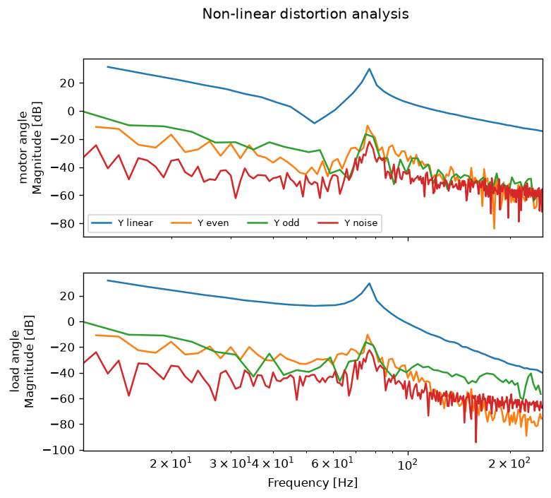

**Step 4 — parametric estimation** &nbsp;(`step4_parametric_estimation.py` ← `Step_4_ParametricEstimation.m`): SIMO deterministic (WLS/NLS) and stochastic (ML/BTLS) estimators.

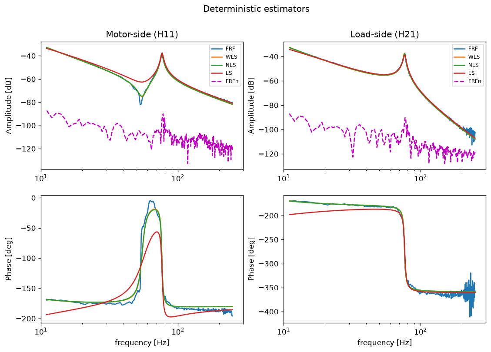
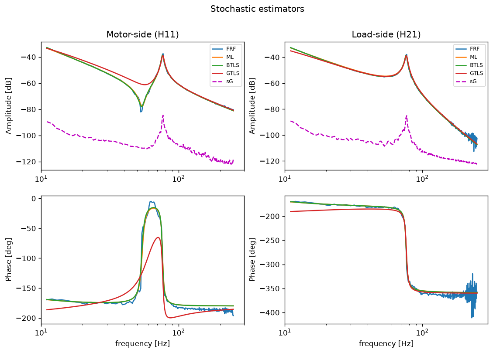

**Step 5 — selection & validation** &nbsp;(`step5_selection_validation.py` ← `Step_5_SelectionValidation.m`): residual-whiteness, cost-function and chi-squared tests.

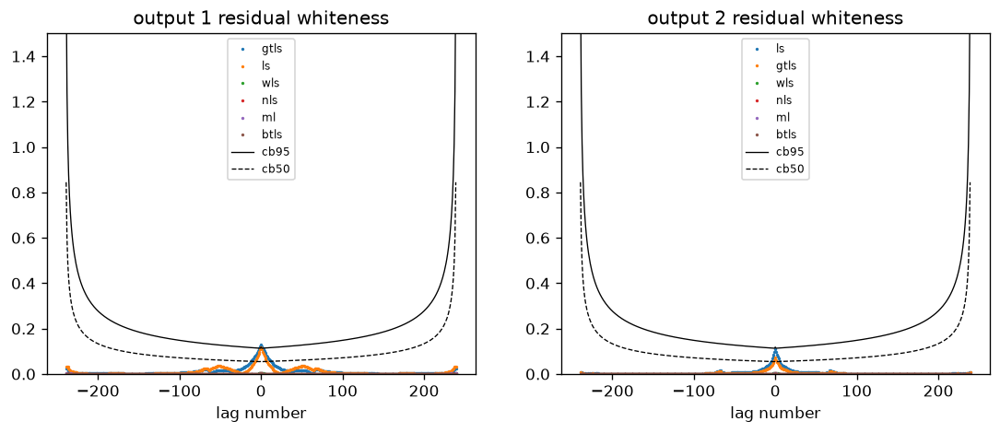
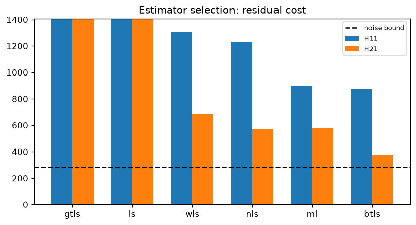
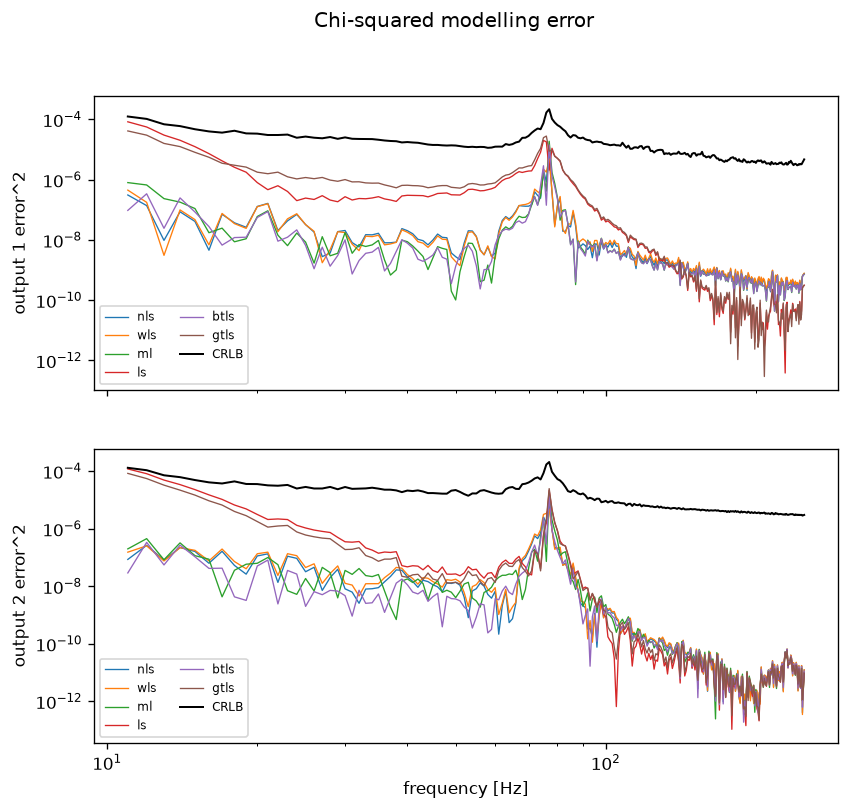

### Tutorials

Ported from MATLAB `Tutorial_*`; they identify the benchmark plant `mdl.Pv(1,1)`.
The converted model (`MATLAB/Examples/private/ident_python.mat`) is **included in
the repository**, so these run with the real plant out of the box — **no MATLAB
needed**.  (If that file is ever missing they fall back to a synthetic stand-in
and print a note.)

**Tutorial 1 — random noise** &nbsp;(`tutorial_1_random.py`): Welch FRF (SciPy) + NLS fit.

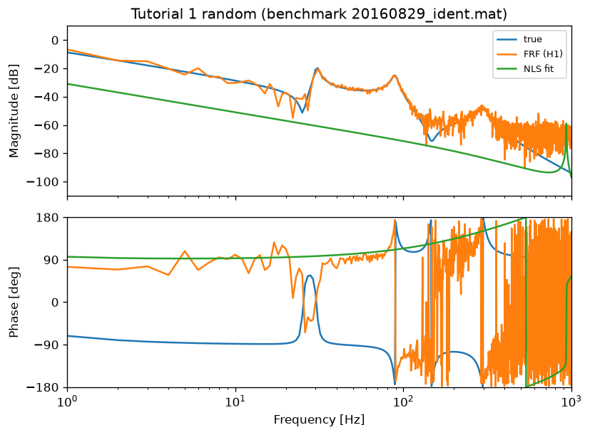

**Tutorial 1 — swept sine** &nbsp;(`tutorial_1_chirp.py`): periodic H1 + NLS fit.

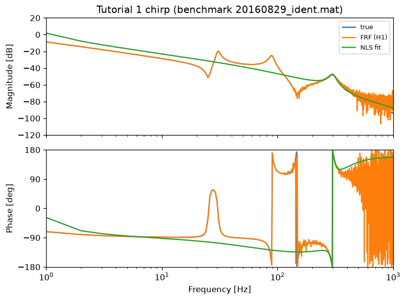

**Tutorial 1 — quasi-log multisine** &nbsp;(`tutorial_1_qlog.py`): full estimator panel.

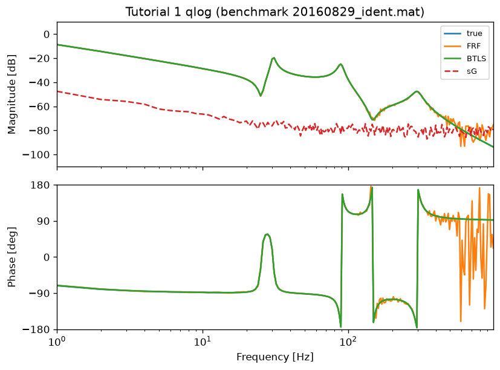

**Tutorial 2 — iterative** &nbsp;(`tutorial_2_iterative.py`): three experiments combined with `fcat_fdi`/`fdel_fdi`.

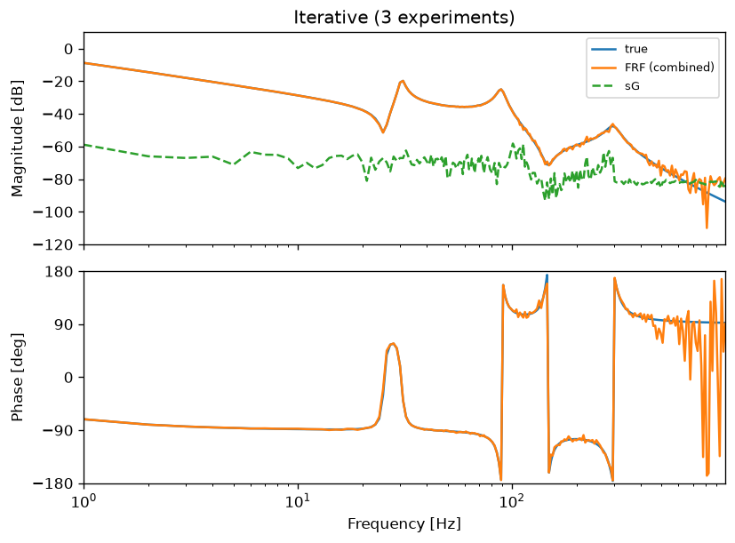

**Tutorial 3 — input non-linearity** &nbsp;(`tutorial_3_nonlinear_in.py`).

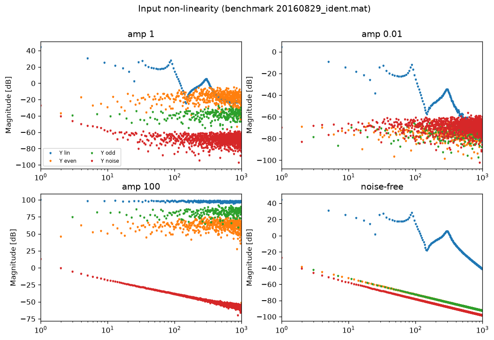

**Tutorial 3 — output non-linearity** &nbsp;(`tutorial_3_nonlinear_out.py`): the Simulink `model_nl_out.slx` (output fed back through a polynomial) reproduced as a state-space ODE.

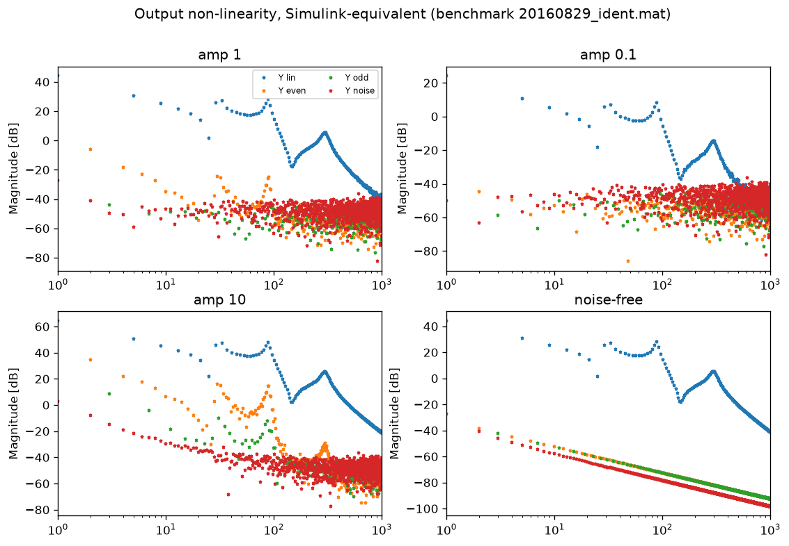

### v3.0 features

**LPM** &nbsp;(`tutorial_lpm.py`): on a short, transient-corrupted record the
Local Polynomial Method models the transient and stays low-bias, while plain ML
(no transient removal) is biased by leakage.

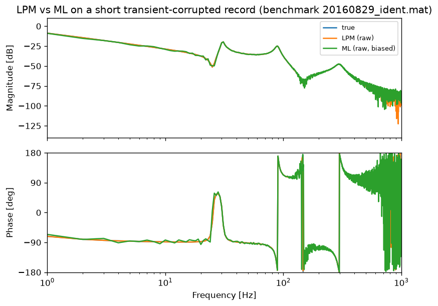

**MIMO + modal** &nbsp;(`tutorial_4_mimo.py`): a 2x2 plant identified from an
orthogonal 2-input multisine with `time2frf_ml`/`time2frf_lpm`, then `frf2modal`
recovers the modal parameters and a real state-space model.

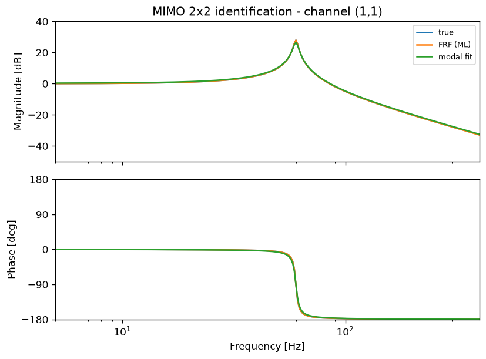

### Benchmark model `20160829_ident.mat`

The original `20160829_ident.mat` stores MATLAB *control objects* (`mdl.Pv` is a
2×1 `zpk`, `mdl.Pp` too) that SciPy cannot read.  It has already been converted to
a SciPy-readable state-space file, **`MATLAB/Examples/private/ident_python.mat`,
which is committed to the repo** — so you can run everything without MATLAB.

You only need MATLAB if you want to **regenerate** that file (e.g. after changing
the source model):

```matlab
>> cd MATLAB/Examples/private
>> convert_ident_to_python      % rewrites ident_python.mat
```

Load the plant directly with:

```python
from examples._data import load_ident, benchmark_plant
P0 = load_ident("Pv", (0, 0))   # control.StateSpace == MATLAB mdl.Pv(1,1)
P0, label = benchmark_plant()   # real model if converted, else synthetic
```

## API conventions

* **Transfer-function arrays** (`Hm`) are 2-D `object` NumPy arrays of SISO
  `control.TransferFunction`, indexed `Hm[o, i]` (output, input), mirroring the
  MATLAB `Hm(o, i)`.
* **`FrfData`** replaces the MATLAB `frd` object enriched with `UserData`.
  `Pest.freq` (Hz), `Pest.response` (`(nrofo, nrofi, nroff)`), `Pest.userdata`
  (`.X`, `.Y`, `.sX2`, `.sY2`, `.cXY`, `.sCR`, `.sG`, `.nrofp`, `.FRFn`, `.ms` ...).
  Use `Pest.frf_columns()` for the `(nroff, nrofh)` matrix and `Pest.to_frd()`
  for a genuine `control.FrequencyResponseData`.
* **Dual calling convention**: the iterative estimators accept either a `FrfData`
  (structured) or the classical positional argument list, exactly like MATLAB.
* **Model orders** `mh`/`ml`: a scalar or flat list is one entry per transfer
  function; a `(nrofo, nrofi)` array follows the MATLAB column-major convention.
* **`SYS` for validation tests** is a `dict` mapping a model name to a transfer
  function array, replacing the MATLAB struct.
* **MIMO** (v3.0): pass the experiments as a `(N, nch, ne)` array to
  `time2frf_ml`/`time2frf_lpm`; the result is an `(ny, nu, nl)` `FrfData` with
  `UserData.sG` of shape `(ny, nu, nl)` and `UserData.method`
  (`'orthogonal'`/`'zippered'`/`'lpm'`). `time2bla_mimo` returns a `dict`.
* **`bode_fdi`** (v3.0 signature): `bode_fdi(sys, unc=..., sigma=..,
  style='line'|'band', legend=[...], ...)` — `unc` is a UserData field name,
  an `(freq, mag)` pair, or a magnitude vector.

## Known limitations vs. the MATLAB toolbox

* **Random phases** (`randph`) use NumPy's Mersenne-Twister; designs are
  reproducible within Python but **not bit-identical** to MATLAB's `rng`.
* **`msinl2p`** ports the in-only crest-factor minimisation used by `multisine`;
  the additional-harmonic (snow, `Fa`) and input/output (`H`) branches are not
  ported and raise `NotImplementedError`.
* **`splinefit`** is a SciPy-backed least-squares spline fit; robustness
  iterations and derivative constraints of the original are not ported.
* **`ssfdi`** is a direct port of the MATLAB "work in progress" function (the
  interactive order prompt is replaced by a required `order` argument).
* **`gtlsfdi`/`btlsfdi`** faithfully reproduce the original `try chol(A)…catch`
  behaviour (the `catch` branch always runs) so results match MATLAB.
* **Plotting** (`bode_fdi`) requires `matplotlib` and is imported lazily.
* **`frf2modal`** proportional damping uses real mode shapes throughout (the
  correct structure for proportional damping); the general path keeps complex
  shapes as in MATLAB.
* The **zippered single-experiment LPM** (`nu>1`, one experiment) is not ported —
  use the orthogonal multiple-experiment design for MIMO LPM (recommended for
  sharp modes). The zippered path of `time2frf_ml` *is* available.
* The MATLAB **`iodata`** OO container is intentionally not reproduced; MIMO is
  handled function-style by passing `(N, nch, ne)` arrays.

## License

Same as the original FdiTools project (see [LICENSE](LICENSE)).
